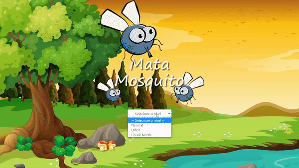

# Mata Mosquito

## Visualização

<h1 align="center">

</h1>

<a href="https://mmanaclara.github.io/mata-mosquito/">Acesse a página 🦟</a>

## 💻 Projeto

O Mata Mosquito teve a proposta de colocar em prática conhecimentos sobre o JavaScript. Na página inicial, é possível selecionar o nível de dificuldade, que está relacionado ao intervalo do aparecimento aleatório dos mosquitos na tela. O jogador começa com três vidas, representadas por três corações na parte inferior da tela, e vai perdendo-as, caso deixe de matar algum mosquito. O objetivo é matar todos os mosquitos até que o tempo se esgote, sendo assim o jogador direcionado para a página de vitória. Caso isso não ocorra, será direcionado à página de derrota. 
O maior desafio ao realizar o projeto foi entender sua lógica de funcionamento no JavaScript. 

## 🧬 Linguagens
Este projeto foi desenvolvido utilizando as seguintes linguagens:
* HTML;
* CSS;
* JavaScript.

## 📖 Conhecimento
Com o Mata Mosquito, aprendi a utilizar: 
* `Window.innerWidth e Height` para definir a dimensão do palco do jogo; 
* `appendChild` para inserir a imagem do mosquito na estrutura do DOM.
* `Math.random` para indicar aleatoriamente a posição, o lado e o tamanho do mosquito; 
* `setInterval` para determinar o intervalo em que os mosquitos aparecem;

## 💾 Baixar o projeto
Faça o clone do repositório para ter uma versão do projeto em sua máquina: 
`$ git clone https://github.com/mmanaclara/mata-mosquito.git` 

## 📝 Licença
Este projeto está licenciado nos termos da licença [MIT](https://github.com/mmanaclara/mata-mosquito/blob/main/LICENSE). 

<a href="#topo">⬆</a>

